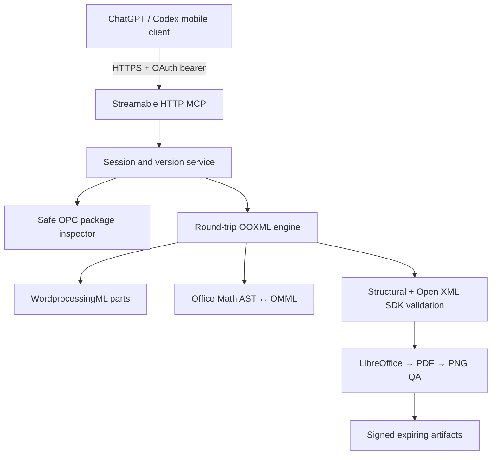

# WordToolkit architecture

## Outcome and scope

WordToolkit is a remote, authenticated MCP service for copy-on-write DOCX editing. Its primary representation is the OPC ZIP package and WordprocessingML parts, not Markdown or a `python-docx` object graph. A document is unpacked in a session-owned directory, known XML parts are parsed with hardened `lxml`, binary and unknown parts are retained, and only marked parts are serialized on save.

## Component boundaries

- `server/app.py`: Starlette application, MCP Streamable HTTP mount, OAuth resource metadata, transport security, health endpoints and signed downloads.
- `server/tools.py`: 65 transport-neutral MCP tools with precise schemas, side-effect annotations, OAuth scope checks, version conflicts and an error boundary.
- `server/live_tools.py`: 38 Windows desktop tools registered only by the local STDIO server.
- `live_word.py`: attach-only Word COM bridge with opaque handles, bounded semantic inspection of 23 native collections, installed object-model and member-capability operations, selection/review/Undo tokens, transactional find/replace, live comments and revisions, bounded layout diagnostics, guarded Undo, fast native bookmarks/fields/tables/table calculations/lists, native OMath read-back and same-path saving.
- `live_learning.py`: bounded equation-outcome plus adaptive structure-type/property policies that never retain property values, document content, paths or identifiers.
- `live_object_model.py`: bounded extraction and atomic caching of type, member, parameter and enum metadata from the installed Word COM type library; document state and help paths never enter the catalog.
- `live_member_capabilities.py`: deterministic one-profile-per-member registry, safety classification, typed target/result/argument preflight and stable capability IDs.
- `sessions.py`: opaque session/document/artifact IDs, owner isolation, per-document locks, TTL and cleanup.
- `security.py`: archive, XML, relationship and remote-file controls.
- `engine/document.py`: stable adapter over the vendored OOXML mixins, snapshot/save, preservation accounting, OMML insertion and static layout checks.
- `math/*`: canonical semantic AST and converters for LaTeX, UnicodeMath, Presentation MathML, direct OMML and structured JSON.
- `engine/validator.py`: ZIP CRC, content types, relationships, unique IDs, notes, OMML and optional Microsoft Open XML SDK validation.
- `engine/renderer.py`: isolated LibreOffice profile, PDF export, Poppler page images and visual heuristics.
- `runtime.py`: authorized file download, SSRF controls, artifact registration and HMAC-signed URLs.

The MCP layer has no direct ZIP/XML manipulation. The document engine has no authentication or HTTP concerns. The renderer never mutates the uploaded original.

## Session and identifier model

An OAuth `sub` claim is hashed to a non-reversible owner key. IDs have opaque random forms such as `ses_<base32>`, `doc_<base32>` and `art_<base32>`; they contain no path or user information. Every session has a root beneath the configured storage root. A document may only be resolved when its owner and live session match the caller.

Mutations accept optional `expected_version`. A mismatch returns `VERSION_CONFLICT`, preventing two mobile turns from silently overwriting the same draft. Exports increment the draft version and write `versions/<document-id>/vN-<name>.docx`; the original upload is never overwritten. Per-document async locks serialize in-process mutations.

Sessions and artifacts expire independently. Cleanup closes XML trees and removes session directories. Artifact URLs contain owner, expiry and HMAC; download responses are private/no-store and content-sniffing is disabled.

## OPC and round-trip preservation

Opening requires `[Content_Types].xml`, `_rels/.rels` and `word/document.xml`. Known stories include styles, numbering, settings, font table, document relationships, headers, footers, comments, extended comments, footnotes and endnotes. Other files remain in the extracted package as opaque parts.

Older documents may lack valid `w14:paraId` anchors. On open, WordToolkit assigns IDs only to missing/invalid/duplicate paragraph anchors in loaded Word stories, marks those parts as intentionally modified and reports the normalization. This is necessary for deterministic fine-grained MCP edits and is never hidden as byte preservation.

The save algorithm walks the extracted package:

1. A part not marked modified is copied byte-for-byte.
2. A modified parsed XML part is serialized once.
3. New binary/XML parts registered by an operation are added.
4. Conservative pre-save repairs run.
5. The new ZIP is validated.
6. SHA-256 hashes compare before/after. Missing or unexpectedly changed unmodified parts fail the preservation report.

This guarantees observable round-trip preservation for untouched parts. It does not claim byte-identical reserialization of parts that were intentionally edited.

DOTX input is copied to a new DOCX and its main-part content type is converted from template to document. DOCM/DOTM and macro content types are rejected.

## Native Office Math

The canonical equation model represents rows, identifiers, numbers, operators, text, fractions, superscripts/subscripts, radicals with degree, n-ary operators, delimiters, matrices, equation arrays, accents, limits and functions. Input parsers normalize into this model; output writers generate native Office Math namespace elements.

- Inline result: `m:oMath` within a Word paragraph.
- Display result: `m:oMathPara` containing `m:oMath`.
- No implicit bitmap or plain-text fallback exists.
- Direct OMML is parsed and regenerated through the canonical model, so unsafe/unrecognized XML is not blindly injected.
- Equality tests compare canonical ASTs, not XML prefixes or attribute ordering.

Equation numbering creates `SEQ Equation` fields and bookmarks. References use native `REF ... \\h` fields. Word/LibreOffice may refresh cached field results when the document opens.

## Validation and visual QA

Every committed DOCX goes through package inspection and structural validation. The Docker image additionally contains a single-file .NET utility using `DocumentFormat.OpenXml.Validation.OpenXmlValidator`. A validation failure prevents artifact publication.

Rendering uses a new LibreOffice user profile for each conversion, with macros disabled by policy and a subprocess timeout. PDF pages are rasterized deterministically, one page at a time, after stale previews are removed and each PNG is decoded to detect truncation. Current automatic heuristics detect blank or suspiciously sparse pages and ink touching physical page edges. Static checks compare table geometry with the effective section/column width and flag headings without keep-with-next.

The result is a compatibility check, not a promise of pixel equality with Microsoft Word. A gated Windows/Word interoperability script is included for a licensed self-hosted CI runner.

## API evolution

The tool contract is versioned independently from the implementation. `schemas/mcp-tools.v1.json` is the source of truth. Additive optional fields are permitted within v1. A renamed tool, new required field, changed type, removed enum member or changed side effect requires a new major schema and migration note. Document migrations are explicit copy-on-write operations.
